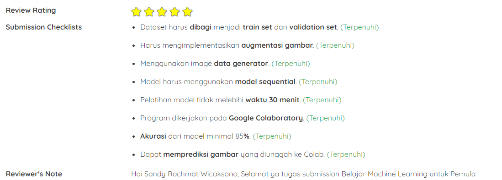

# Dicoding - Belajar Machine Learning untuk Pemula
---
Alhamdulillah submission mendapatkan rating bintang lima. Ada tambahan dari tugas yang diberikan adalah melakukan pertandingan suit/suten dari input gambar yang dimasukkan, pertandingan suit hanyalah sebuah random yang diterjemahkan menjadi gambar.

## Learn Machine Learning for beginer using Rock Paper Scissor dataset
---
This repository contains jupyter notebook for classifying the user upload image in rock, paper, scissor game. Using Tensorflow and Keras for Machine Learning Backend. Training data it's about 18-20 minute for 20 epoch with accuracy above 95%. Besides user upload image prediction, this jupyter notebook also creating mini-game with dueling the user input with random function (from random.random()) which becomes one of choice from rock, paper, or scissors. Then with common knowledge of this game which makes a decision if the machine wins, lose, or draw.

